# B2B Data Warehouse — ELT Pipeline

This is a data warehouse for a B2B e-commerce platform. It takes data from
three sources — the platform database, web server logs, and a marketing
spreadsheet — loads it into a warehouse, and answers three business questions.

Work in progress. See the [roadmap](#roadmap) for what is done so far.

## Architecture



The idea is simple: Python only moves and checks data. All the real
transformation happens inside the warehouse with SQL, using dbt. In the
diagram, shaded boxes are places where data sits, plain boxes are steps that
do something.

Layers:

| Layer | What is in it |
|---|---|
| Source | Postgres, weblog file, leads spreadsheet |
| Landing | Parquet files, so I can reload without touching the sources again |
| Bronze `raw_*` | Copy of the source data, nothing changed |
| Silver `stg_*` | Cleaned and typed, one model per source table |
| Gold `dim_*` `fct_*` `rpt_*` | Star schema and the report models |

## Why these tools

| Tool | Reason |
|---|---|
|  **Postgres in Docker** | This is what a real B2B platform would run on. One container, so it is easy to start |
|  **SQLAlchemy** | Schema lives in one place, in Python |
|  **Faker** | Generated data, seeded, so everyone gets the same numbers |
|  **Pydantic** | Validation. Checks every row when it comes in. Bad rows go to a rejects table instead of being dropped |
|**Parquet landing zone** | Snapshotting. If the load fails I do not need to read the sources again |
|  **DuckDB** | Column store, made for analytics. It is a single file, so there is nothing to install |
|  **dbt** | SQL transformations in version control, with tests and lineage |
|  **Own Python runner** | The task asks for restartable jobs and metadata tracking. I wanted to show how it works, not hide it behind a tool |
|**uv, Make, pytest, ruff** | Environment, commands, tests, linting |

## What the task asked for and where it is

| Requirement | Where |
|---|---|
| B2B database with generated data | `generators/seed_platform.py` |
| Weblog generated by a script | `generators/gen_weblog.py` |
| Target data warehouse | DuckDB, models in `dbt_project/models/` |
| Handle large data | Batched reads, Parquet, and set-based SQL in DuckDB |
| Restartable jobs | `--restart` in `src/dwh/runner.py`, skipping jobs that already succeeded |
| Initial load | `make all` |
| Handle bad data | Pydantic on the way in, dbt tests after loading |
| ETL metadata | `runs`, `job_runs` and `rejects` tables, written from `src/dwh/metadata.py` |
| Readable format for reporting | Star schema and `rpt_*` models |

## Reports

1. Top 5 devices used by B2B clients
2. Most popular products in the country where most users log in from
3. Sales by month for the last year

## What you need

Docker, Make, and [uv](https://docs.astral.sh/uv/). D2 is optional — only if
you want to regenerate the diagrams, since the rendered SVGs are committed.

## How to run it

```bash
make up                            # start Postgres
make seed                          # generate the three sources
make run                           # run the whole pipeline
make report                        # print the business reports
```

Or `make all` for all of it in one go. The pipeline and the reports both take
options:

```bash
make run ARGS="--from bronze"      # enter at a later stage
make run ARGS="--restart"          # resume the last failed run
make report ARGS="--section all"   # business, run summary and data quality
```

## Project structure
```
src/dwh/ extract, validate, load, runner, metadata
generators/ scripts that create the fake source data
dbt_project/ staging and mart models, tests
docs/ diagrams (D2 source and rendered SVG)
tests/
```
Generators are outside `src/` on purpose. They only exist to create fake
source data, they are not part of the system itself.

## Some decisions worth explaining

**ELT and not ETL.** Python reads and validates, but does not transform.
Everything else happens in SQL inside DuckDB. Bronze stays exactly as the
source gave it, so I can rebuild everything downstream without going back to
Postgres or the files.

**Two places for validation.** Pydantic catches broken rows at the door —
missing fields, wrong types, unparseable log lines. dbt tests catch the
problems you can only see after loading, like a foreign key with no match or
duplicate keys.

## If this had to scale

With much bigger volumes I would move log ingestion to Kafka and keep the same
parse and validate logic in a consumer. DuckDB would become Snowflake or
BigQuery, and the Python runner would become Airflow. The data model itself
would stay the same, which is the point of keeping modelling separate from
storage.

## Roadmap

- [x] Source database and generated data
- [x] Extract, validate, land as Parquet
- [x] Load into DuckDB bronze
- [x] dbt staging and mart models
- [x] Run metadata and restart logic
- [x] Reports
- [ ] Short demo video